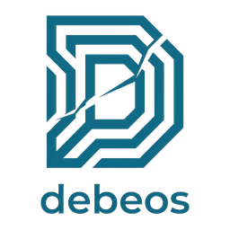

# DeBeOS Maturity Roadmap

The north star for where DeBeOS is going. DeBeOS is **ARM-first** and its guiding
goal after bring-up is **self-sufficiency** — the ability to build real software
*on the machine*, not merely cross-compile it elsewhere. Priorities are ordered by
stage; each stage's status reflects what has actually been measured on real hardware,
and open items are named honestly rather than hidden.

## Stage 0 — Bring-up ✅ *(done)*
Native boot on AWS Graviton, the ENA network driver, remote desktop (in-tree browser
plus a remote client), clean ACPI shutdown, and serial-console boot logs. See
[the "What works today" table in the README](README.md#what-works-today-measured).

## Stage 1 — Self-sufficiency *(in progress)*
Build real software **on DeBeOS**, not just cross-compiled for it.

1. **ripgrep** and **fd** cross-built for `aarch64-unknown-haiku` and packaged as hpkg.
2. **ripgrep built natively on-device** — the real self-sufficiency test, exercising
   networking, TLS and DNS that a self-hosting compiler never touches.
3. **cargo ↔ crates.io works natively** — a live `cargo build` fetches and compiles
   real crates from crates.io on the machine; the BSD socket layer, TLS and DNS are
   all sufficient. (A pure-Rust TLS stack, avoiding the C crypto libraries, is a
   nice-to-have still open.)
4. **Open:** a repeatable `crate name → native binary + hpkg` script, and — the current
   blocker for *large* native builds — **filesystem/toolchain reliability under heavy
   load**. Driving a big native Rust build surfaced a page-writer / BFS defect that
   corrupts freshly written files under concurrent I/O (and a linker limit on very
   large objects). Fixing the filesystem reliability is the active priority; it also
   directly advances Stage 4's crash-safety work.

## Stage 2 — Package ecosystem
- **Repository:** start with a flat directory of hpkg files plus a manual index that
  `pkgman`/HaikuDepot can point at; then automate builds on release; then decide
  whether binaries bundle their runtime libraries or rely on a system base package.
- **Porting playbook:** a living "symptom → root cause → fix" document plus a starter
  target-spec template, so per-port flags aren't re-derived by hand each time.
- **Critical mass of tools:** uutils/coreutils (one port, dozens of utilities), then
  Node.js on Haiku's existing libuv port (a real integration project).

## Stage 3 — Platform expansion
Raspberry Pi 5, Raspberry Pi 3, and RISC-V — which forces a clean separation between
"ARM-first / portable OS" and Graviton-specific assumptions.

## Stage 4 — Robustness
A legacy-bug audit, device watchdogs, and **filesystem crash-safety on a forced stop**
(closely related to the Stage-1 reliability work).

## Stage 5 — Identity & distribution
An open question worth resolving early, because it shapes how much Stage 2/3 investment
is worthwhile: **hobby-complete and self-hosted**, versus **community-distributable**.
